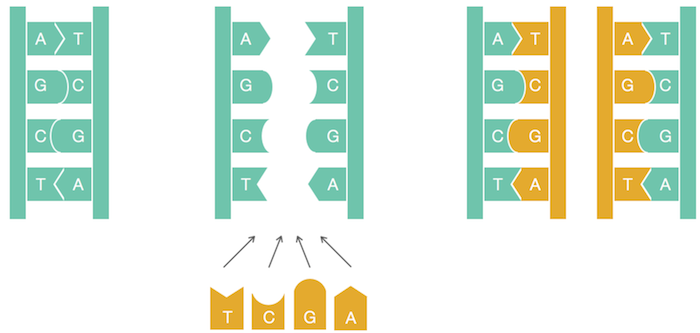
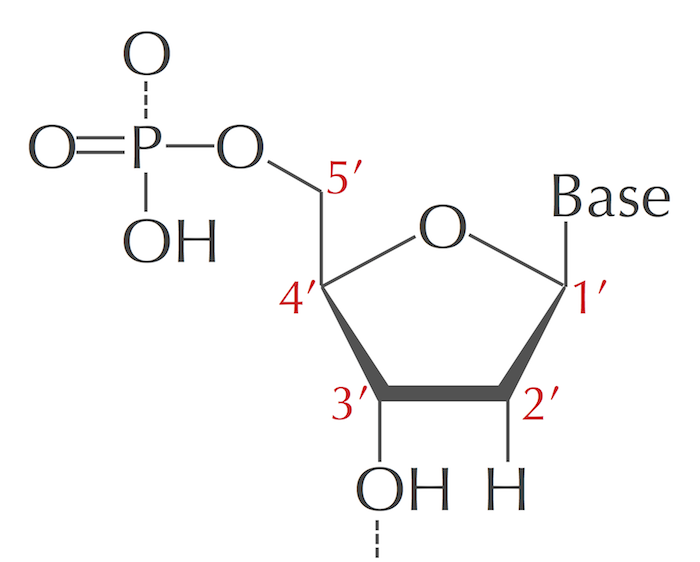
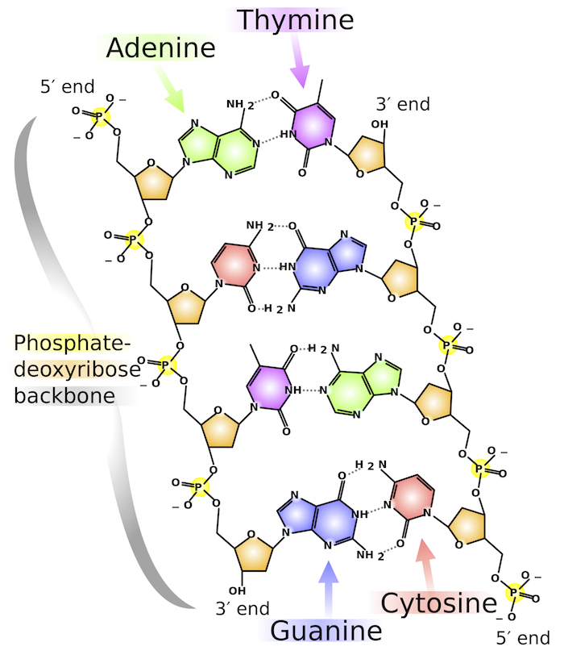
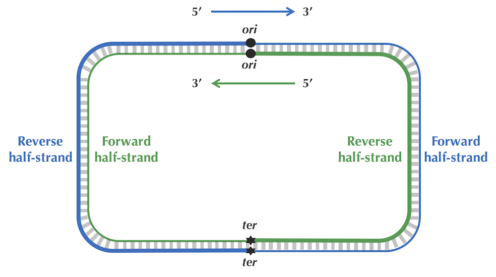
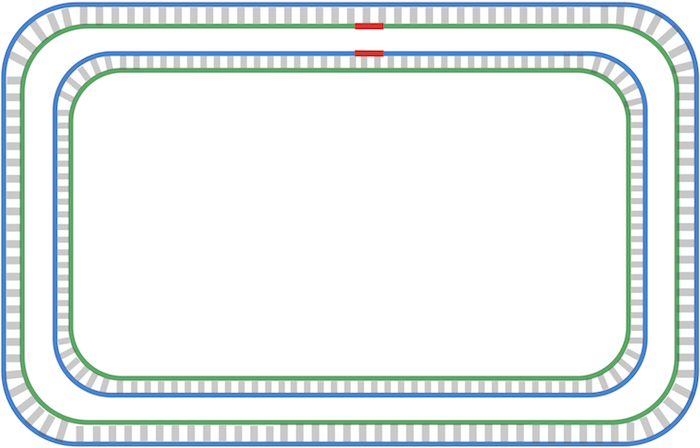
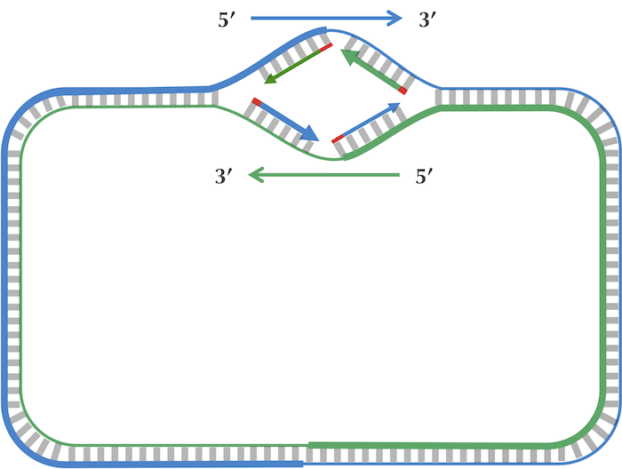
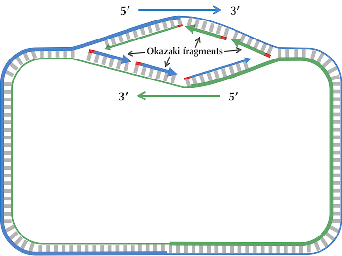
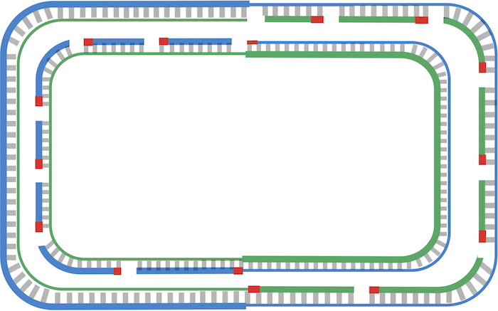
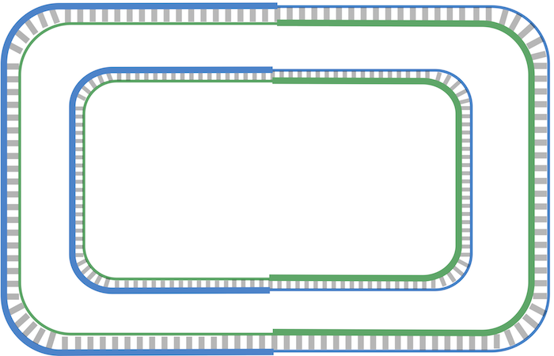

# Genome Replication
**Genome replication** is one of the most important tasks carried out in the cell. Before a cell can divide, it must first replicate its genome so that each of the two daughter cells inherits its own copy.

They conjectured that the two strands of the parent DNA molecule unwind during replication, and then each parent strand acts as a template for the synthesis of a new strand. As a result, the replication process begins with a pair of complementary strands of DNA and ends with two pairs of complementary strands, as shown in the figure below.



Figure: A naive view of DNA replication. Nucleotides adenine (A) and thymine (T) are complements of each other, as are cytosine (C) and guanine (G). Complementary nucleotides bind to each other in DNA.

# Replication Origin
Replication begins in a genomic region called the **replication origin (denoted ori)** and is performed by molecular copy machines called DNA polymerases.

# DnaA
Initiation of replication is mediated by **DnaA**, a protein that binds to a short segment within the ori known as a **DnaA box**. You can think of the DnaA box as a message within the DNA sequence telling DnaA: “bind here!”

# K-mer
A string of length k.

# Most frequent K-mer
The most frequent k-mer is a pattern that maximizes the pattern count among all k-mers in a dna sequence. A sequence can have more than one most frequent k-mer.

# Frequency map
A map of frequencies for all k-mers in a sequence. Something like:
```python
{
    'ATA': 3,
    'ATC': 1,
    'CAT': 1,
    'CCA': 1,
    'CGA': 1,
    'GAT': 1,
    'TAT': 2,
    'TCC': 1,
    'TAG': 1
}
```

# Directionality of DNA strands
The sugar component of a nucleotide has a ring of five carbon atoms, which are labeled as 1’, 2’, 3’, 4’, and 5’ in the figure on the right. The 5’ atom is joined onto the phosphate group in the nucleotide and eventually to the 3’ end of the neighboring nucleotide. The 3’ atom is joined onto another neighboring nucleotide in the nucleic acid chain. As a result, we call the two ends of the nucleotide the 5’-end and the 3’-end (pronounced “five prime end” and ”three prime end”, respectively).



When we zoom out to the level of the double helix, we can see in the figure below that any DNA fragment is oriented with a 3’ atom on one end and a 5’ atom on the other end. As a standard, a DNA strand is always read in the 5' → 3' direction. Note that the orientations run opposite to each other in complementary strands.



# Reverse complements
The reverse complement of a DNA sequence is the string formed by taking the complementary nucleotide of each nucleotide in the sequence, then reversing the resulting string.

# Replication
As illustrated in the figure below (top), the two complementary DNA strands running in opposite directions around a circular chromosome unravel, starting at ori. As the strands unwind, they create two replication forks, which expand in both directions around the chromosome until the strands completely separate at the replication terminus (denoted ter). The replication terminus is located roughly opposite to ori in the chromosome.



An important thing to know about replication is that a DNA polymerase does not wait for the two parent strands to completely separate before initiating replication; instead, it starts copying while the strands are unraveling. Thus, just four DNA polymerases (each responsible for one half-strand) can all start at ori and replicate the entire chromosome. To start replication, a DNA polymerase needs a primer, a very short complementary segment (shown in red in the figure below) that binds to the parent strand and jump starts the DNA polymerase. After the strands start separating, each of the four DNA polymerases starts replication by adding nucleotides, beginning with the primer and proceeding around the chromosome from ori to ter in either the clockwise or counterclockwise direction. When all four DNA polymerases have reached ter, the chromosome’s DNA will have been completely replicated, resulting in two pairs of complementary strands (figure below), and the cell is ready to divide.



**Figure:** Replication is complete.

DNA polymerases are unidirectional, meaning that they can only traverse a template strand of DNA in the 3' → 5' direction. There are four different half-strands of parent DNA connecting ori to ter, as highlighted in the figure below. Two of these half-strands are traversed from ori to ter in the 5' → 3' direction and are thus called forward half-strands (represented by thin blue and green lines in the figure below). The other two half-strands are traversed from ori to ter in the 3' → 5' direction and are thus called reverse half-strands (represented by thick blue and green lines in the figure below).


**Figure:** Complementary DNA strands with forward and reverse half-strands shown as thin and thick lines, respectively.

The replication process is asymmetric, the forward and reverse half-strands are replicated at different rates.

Since a DNA polymerase can only move in the reverse (3' → 5') direction, it can copy nucleotides non-stop from ori to ter along reverse half-strands. However, replication on forward half-strands is very different because a DNA polymerase cannot move in the forward (5' → 3') direction; on these half-strands, a DNA polymerase must replicate backwards toward ori.



On a forward half-strand, in order to replicate DNA, a DNA polymerase must wait for the replication fork to open a little (approximately 2,000 nucleotides) until a new primer is formed at the end of the replication fork; afterwards, the DNA polymerase starts replicating a small chunk of DNA starting from this primer and moving backward in the direction of ori. When the two DNA polymerases on forward half-strands reach ori.

After this point, replication on each reverse half-strand progresses continuously; however, a DNA polymerase on a forward half-strand has no choice but to wait again until the replication fork has opened another 2,000 nucleotides or so. It then requires a new primer to begin synthesizing another fragment back toward ori. On the whole, replication on a forward half-strand requires occasional stopping and restarting, which results in the synthesis of short Okazaki fragments that are complementary to intervals on the forward half-strand. You can see these fragments forming in the figure below.



**Figure:** The replication fork continues growing. Only one primer is needed for each of the reverse half-strands (shown by thick lines), while the forward half-strands (shown by thin lines) require multiple primers in order to synthesize Okazaki fragments. Two of these primers are shown in red on each forward half-strand.

When the replication fork reaches ter, the replication process is almost complete, but gaps still remain between the disconnected Okazaki fragments, as shown in the figure below.



**Figure:** Replication is nearly complete, as all daughter DNA is synthesized. However, half of each daughter chromosome contains disconnected Okazaki fragments.

Finally, consecutive Okazaki fragments must be sewn together by an enzyme called DNA ligase, resulting in two intact daughter chromosomes, each consisting of one parent strand and one newly synthesized daughter strand, as shown in the figure below. In reality, DNA ligase does not wait until after all the Okazaki fragments have been replicated to start sewing them together.



**Figure:** Okazaki fragments have been sewn together, resulting in two intact daughter chromosomes.

