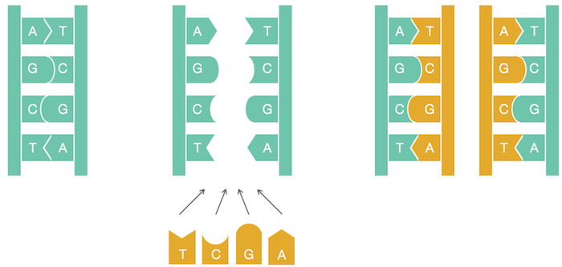
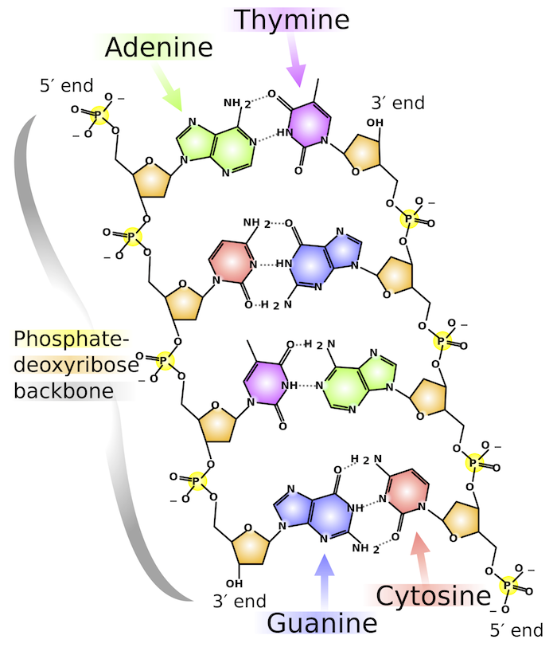
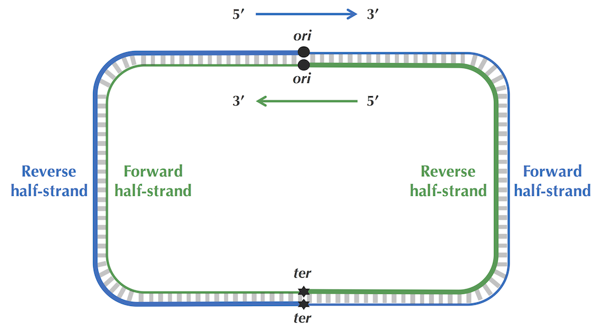
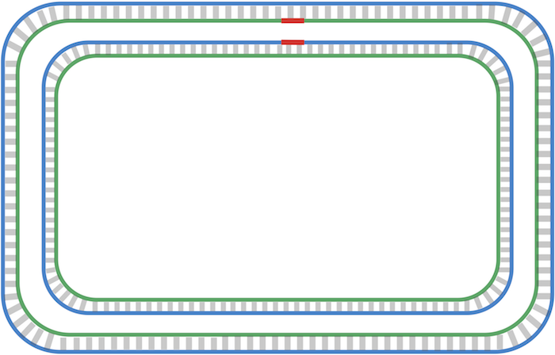
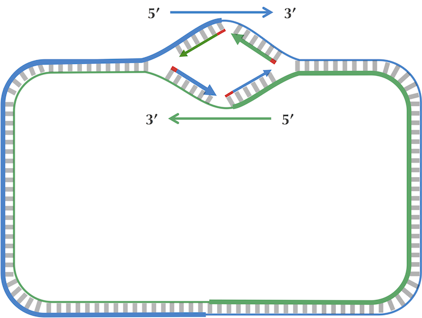
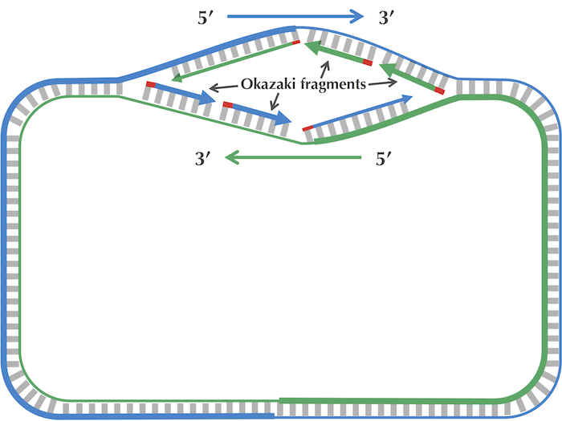
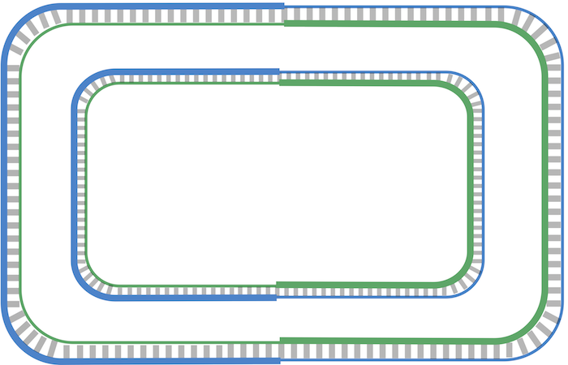
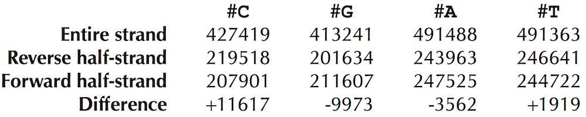
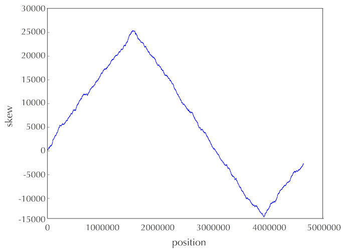

# Genome Replication
**Genome replication** is one of the most important tasks carried out in the cell. Before a cell can divide, it must first replicate its genome so that each of the two daughter cells inherits its own copy.

They conjectured that the two strands of the parent DNA molecule unwind during replication, and then each parent strand acts as a template for the synthesis of a new strand. As a result, the replication process begins with a pair of complementary strands of DNA and ends with two pairs of complementary strands, as shown in the figure below.



Figure: A naive view of DNA replication. Nucleotides adenine (A) and thymine (T) are complements of each other, as are cytosine (C) and guanine (G). Complementary nucleotides bind to each other in DNA.

<br>

# Replication Origin
Replication begins in a genomic region called the **replication origin (denoted ori)** and is performed by molecular copy machines called DNA polymerases.

<br>

# DnaA
Initiation of replication is mediated by **DnaA**, a protein that binds to a short segment within the ori known as a **DnaA box**. You can think of the DnaA box as a message within the DNA sequence telling DnaA: “bind here!”

<br>

# K-mer
A string of length k.

<br>

# Most frequent K-mer
The most frequent k-mer is a pattern that maximizes the pattern count among all k-mers in a dna sequence. A sequence can have more than one most frequent k-mer.

<br>

# Frequency map
A map of frequencies for all k-mers in a sequence. Something like:
```python
{
    'ATA': 3,
    'ATC': 1,
    'CAT': 1,
    'CCA': 1,
    'CGA': 1,
    'GAT': 1,
    'TAT': 2,
    'TCC': 1,
    'TAG': 1
}
```

<br>

# Directionality of DNA strands
The sugar component of a nucleotide has a ring of five carbon atoms, which are labeled as 1’, 2’, 3’, 4’, and 5’ in the figure on the right. The 5’ atom is joined onto the phosphate group in the nucleotide and eventually to the 3’ end of the neighboring nucleotide. The 3’ atom is joined onto another neighboring nucleotide in the nucleic acid chain. As a result, we call the two ends of the nucleotide the 5’-end and the 3’-end (pronounced “five prime end” and ”three prime end”, respectively).


When we zoom out to the level of the double helix, we can see in the figure below that any DNA fragment is oriented with a 3’ atom on one end and a 5’ atom on the other end. As a standard, a DNA strand is always read in the 5' → 3' direction. Note that the orientations run opposite to each other in complementary strands.



<br>

# Reverse complements
The reverse complement of a DNA sequence is the string formed by taking the complementary nucleotide of each nucleotide in the sequence, then reversing the resulting string.

<br>

# Replication
As illustrated in the figure below (top), the two complementary DNA strands running in opposite directions around a circular chromosome unravel, starting at ori. As the strands unwind, they create two replication forks, which expand in both directions around the chromosome until the strands completely separate at the replication terminus (denoted ter). The replication terminus is located roughly opposite to ori in the chromosome.



An important thing to know about replication is that a DNA polymerase does not wait for the two parent strands to completely separate before initiating replication; instead, it starts copying while the strands are unraveling. Thus, just four DNA polymerases (each responsible for one half-strand) can all start at ori and replicate the entire chromosome. To start replication, a DNA polymerase needs a primer, a very short complementary segment (shown in red in the figure below) that binds to the parent strand and jump starts the DNA polymerase. After the strands start separating, each of the four DNA polymerases starts replication by adding nucleotides, beginning with the primer and proceeding around the chromosome from ori to ter in either the clockwise or counterclockwise direction. When all four DNA polymerases have reached ter, the chromosome’s DNA will have been completely replicated, resulting in two pairs of complementary strands (figure below), and the cell is ready to divide.



**Figure:** Replication is complete.

DNA polymerases are unidirectional, meaning that they can only traverse a template strand of DNA in the 3' → 5' direction. There are four different half-strands of parent DNA connecting ori to ter, as highlighted in the figure below. Two of these half-strands are traversed from ori to ter in the 5' → 3' direction and are thus called forward half-strands (represented by thin blue and green lines in the figure below). The other two half-strands are traversed from ori to ter in the 3' → 5' direction and are thus called reverse half-strands (represented by thick blue and green lines in the figure below).


**Figure:** Complementary DNA strands with forward and reverse half-strands shown as thin and thick lines, respectively.

The replication process is asymmetric, the forward and reverse half-strands are replicated at different rates.

Since a DNA polymerase can only move in the reverse (3' → 5') direction, it can copy nucleotides non-stop from ori to ter along reverse half-strands. However, replication on forward half-strands is very different because a DNA polymerase cannot move in the forward (5' → 3') direction; on these half-strands, a DNA polymerase must replicate backwards toward ori.



On a forward half-strand, in order to replicate DNA, a DNA polymerase must wait for the replication fork to open a little (approximately 2,000 nucleotides) until a new primer is formed at the end of the replication fork; afterwards, the DNA polymerase starts replicating a small chunk of DNA starting from this primer and moving backward in the direction of ori. When the two DNA polymerases on forward half-strands reach ori.

After this point, replication on each reverse half-strand progresses continuously; however, a DNA polymerase on a forward half-strand has no choice but to wait again until the replication fork has opened another 2,000 nucleotides or so. It then requires a new primer to begin synthesizing another fragment back toward ori. On the whole, replication on a forward half-strand requires occasional stopping and restarting, which results in the synthesis of short Okazaki fragments that are complementary to intervals on the forward half-strand. You can see these fragments forming in the figure below.



**Figure:** The replication fork continues growing. Only one primer is needed for each of the reverse half-strands (shown by thick lines), while the forward half-strands (shown by thin lines) require multiple primers in order to synthesize Okazaki fragments. Two of these primers are shown in red on each forward half-strand.

When the replication fork reaches ter, the replication process is almost complete, but gaps still remain between the disconnected Okazaki fragments, as shown in the figure below.


**Figure:** Replication is nearly complete, as all daughter DNA is synthesized. However, half of each daughter chromosome contains disconnected Okazaki fragments.

Finally, consecutive Okazaki fragments must be sewn together by an enzyme called DNA ligase, resulting in two intact daughter chromosomes, each consisting of one parent strand and one newly synthesized daughter strand, as shown in the figure below. In reality, DNA ligase does not wait until after all the Okazaki fragments have been replicated to start sewing them together.



**Figure:** Okazaki fragments have been sewn together, resulting in two intact daughter chromosomes.

<br>

# Deamination
As the replication fork expands, DNA polymerase synthesizes DNA quickly on the reverse half-strand but suffers delays on the forward half-strand. We will explore the asymmetry of DNA replication to design a new algorithm for finding ori. 

How in the world can the asymmetry of replication possibly help us locate ori? Notice that since the replication of a reverse half-strand proceeds quickly, it lives double-stranded for most of its life. Conversely, a forward half-strand spends a much larger amount of its life single-stranded, waiting to be used as a template for replication. This discrepancy between the forward and reverse half-strands is important because single-stranded DNA has a much higher mutation rate than double-stranded DNA. In particular, if one of the four nucleotides in single-stranded DNA has a greater tendency than other nucleotides to mutate in single-stranded DNA, then we should observe a shortage of this nucleotide on the forward half-strand.

Following up on this thought, let’s compare the nucleotide counts of the reverse and forward half-strands. If these counts differ substantially, then we will design an algorithm that attempts to track down these differences in genomes for which ori is unknown. The nucleotide counts for Thermotoga petrophila are shown in the figure below.



**Figure:** Counting nucleotides in the Thermotoga petrophila genome on the forward and reverse half-strands.

Although the frequencies of A and T are practically identical on the two half-strands, C is more frequent on the reverse half-strand than on the forward half-strand, resulting in a difference of 219518 - 207901 = +11617. Its complementary nucleotide G is less frequent on the reverse half-strand than on the forward half-strand, resulting in a difference of 201634 - 211607 = -9973.

It turns out that we observe these discrepancies because cytosine (C) has a tendency to mutate into thymine (T) through a process called deamination. Deamination rates rise 100-fold when DNA is single-stranded, which leads to a decrease in cytosine on the forward half-strand, thus forming mismatched base pairs T-G. These mismatched pairs can further mutate into T-A pairs when the bond is repaired in the next round of replication, which accounts for the observed decrease in guanine (G) on the reverse half-strand (recall that a forward parent half-strand synthesizes a reverse daughter half-strand, and vice-versa).

Since we know that C is more frequent in half of the genome and less frequent in the other half, our idea is to slide a giant window of length len(Genome)//2 down the genome, counting the number of occurrences of C in each window. Inspired by the nucleotide counts table in Vibrio cholerae, our hope is that the window having the fewest occurrences of C will roughly correspond to the forward half-strand and that the window having the most occurrences of C will roughly correspond to the reverse half-strand. And if we know where the forward and reverse half-strands are, then we have found ori!

<br>

# Analyzing a genome’s half-strands

Although most bacteria have circular genomes, we have thus far assumed that genomes were linear, a reasonable simplifying assumption because the length of the window is much shorter than the length of the genome. This time, because we are sliding a giant window, we should account for windows that “wrap around” the end of Genome. To do so, we will define a string ExtendedGenome as Genome+Genome[0:n//2]. That is, we copy the first len(Genome)//2 nucleotides of Genome to the end of the string (figure below).

**CTGCTTCGCCCGCCGGACCGGCCTCGTGATGGGGT**<span style="color:green">**CTGCTTCGCCCGCCGGA**</span>.

**Figure:** A DNA string Genome (shown in bold) containing 35 nucleotides that is extended by its first 17 nucleotides (shown in bold green) to yield ExtendedGenome.

We will keep track of the total number of occurrences of C that we encounter in each window of ExtendedGenome by using a symbol array. The i-th element of the symbol array is equal to the number of occurrences of the symbol in the window of length len(Genome)//2 starting at position i of ExtendedGenome. For example, see the figure below.


**Figure:** The symbol array for Genome equal to "AAAAGGGG" and symbol equal to "A".

# Finding Ori
The figure below visualizes the symbol array for E. coli and symbol equal to "C". Notice the clear pattern in the data! The maximum value of the array occurs around position 1600000, and the minimum value of the array occurs around position 4000000. We can therefore infer that the reverse half-strand begins around position 1600000, and that the forward half-strand begins around position 4000000. Because we know that ori occurs where the reverse half-strand transitions to the forward half-strand, we have discovered that ori is located in the neighborhood of position 4000000 of the E. coli genome, without ever needing to put on a lab coat!


**Figure:** A plot of the symbol array for the E. coli genome for symbol equal to C.

In the table containing nucleotide counts for T. petrophila (reproduced below), we noted that not just C but also G has peculiar statistics on the forward and reverse half-strands.


In practice, scientists use a more accurate approach that accounts for both G and C when searching for ori. As the above figure illustrates, the difference between the total amount of guanine and the total amount of cytosine is negative on the reverse half-strand and positive on the forward half-strand.

Thus, our idea is to traverse the genome, keeping a running total of the difference between the counts of G and C. If this difference starts increasing, then we guess that we are on the forward half-strand; on the other hand, if this difference starts decreasing, then we guess that we are on the reverse half-strand (see figure below).


**Figure:** Because of deamination, each forward half-strand has more guanine than cytosine, and each reverse half-strand has more cytosine than guanine. The difference between the counts of G and C is therefore positive on the forward half-strand and negative on the reverse half-strand.

We will keep track of the difference between the total number of occurrences of G and the total number of occurrences of C that we have encountered so far in Genome by using a skew array. This array, denoted Skew, is defined by setting Skew[i] equal to the number of occurrences of G minus the number of occurrences of C in the first i nucleotides of Genome (see figure below). We also set Skew[0] equal to zero.


**Figure:** The array Skew for Genome = "CATGGGCATCGGCCATACGCC".

Given a string Genome, we can form its skew array by setting Skew[0] equal to 0, and then ranging through the genome.  At position i of Genome, if we encounter an A or a T, we set Skew[i+1] equal to Skew[i]; if we encounter a G, we set Skew[i+1] equal to Skew[i]+1; if we encounter a C, we set Skew[i+1] equal to Skew[i]-1.

The **skew** diagram of Genome is defined by plotting i against Skew[i] as i ranges from 0 to len(Genome). The figure below shows the skew diagram for the genome from the previous step.


**Figure:** (Top) The skew array for Genome = CATGGGCATCGGCCATACGCC, reproduced from the previous step. (Bottom) The skew diagram corresponding to Genome. The skew increases when we encounter G and decreases when we encounter C.

The figure below depicts the skew diagram for a linearized E. coli genome. The pattern is even stronger than the pattern observed when we visualized the symbol array! It turns out that the skew diagram for many bacterial genomes has a similar characteristic shape.



**Figure:** The skew diagram for E. coli achieves a maximum and minimum at positions 1550413 and 3923620, respectively.

Let’s follow the 5' → 3' direction of DNA and walk along the chromosome from ter to ori (along a reverse half-strand), then continue on from ori to ter (along a forward half-strand). In the figure below, we see that the skew is decreasing along the reverse half-strand and increasing along the forward half-strand. Thus, the skew should achieve a minimum at the position where the reverse half-strand ends and the forward half-strand begins, which is exactly the location of ori!


Solving the Minimum Skew Problem now provides us with an approximate location of ori at position 3923620 in E. coli. In an attempt to confirm this hypothesis, let’s look for a hidden message representing a potential DnaA box near this location. Solving the Frequent Words Problem in a window of length 500 starting at position 3923620 (shown below) reveals no 9-mers (along with their reverse complements) that appear three or more times! Even if we have located the position of ori in E. coli, it appears that we still have not found the DnaA boxes that jump-start replication in this bacterium...


Before we give up, let’s examine the ori of Vibrio cholerae one more time to see if it provides us with any insights on how to alter our algorithm to find DnaA boxes in E. coli. You may have noticed that in addition to the three occurrences of <span style="color:blue">**ATGATCAAG**</span> and three occurrences of its reverse complement <span style="color:purple">**CTTGATCAT**</span>, the Vibrio cholerae ori contains additional occurrences of <span style="color:blue">**ATGATCAA**</span><span style="color:red">**C**</span> and <span style="color:purple">**C**</span><span style="color:red">**A**</span><span style="color:purple">**TGATCAT**</span>, which differ from <span style="color:blue">**ATGATCAAG**</span> and <span style="color:purple">**CTTGATCAT**</span> in only a single nucleotide:


Finding eight approximate occurrences of our target 9-mer and its reverse complement in a short region is even more statistically surprising than finding the six exact occurrences of 
<span style="color:blue">**ATGATCAAG**</span> and its reverse complement <span style="color:red">**CTTGATCAT**</span> that we stumbled upon in the beginning of our investigation. Furthermore, the discovery of these approximate 9-mers makes sense biologically, since DnaA can bind not only to “perfect” DnaA boxes but to their slight modifications as well.

